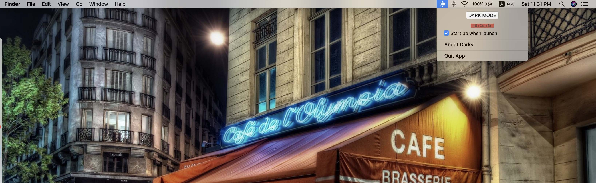

# DarkModeSwitcher


A small Mac OS App that allow you on Mac OS Mojave to switch between Dark Mode and Light Mode directly from a shortcut or via the status menu bar.

You can directly *Download and Install* the App directly from the release folder : https://github.com/mohamed-arradi/DarkModeSwitcher/tree/master/Release

## Why this App can be useful ?

In Mojave in order to change the dark mode status you need to open the system preference each time ! Why having a shortcut could not be more easier ?

This is why I build this tiny status bar app.

## Getting Started

This is a MacOSX App build with xCode using Swift 4.0 and temporary exceptions in order to handle System Events and Preferences panels events

This App cannot be allowed on the Mac App Store due to the necessary temporary exceptions required.

### Prerequisites

This project come along side some pod dependency

```
pod 'OGSwitch'
pod 'LoginServiceKit', :git => 'https://github.com/Clipy/LoginServiceKit.git'
pod 'Magnet'
```

### Installing

```
Pod install
```
And Run the project a small App will appear on top of the screen as per below

### Language handled

- French & English only for now.

In order to change the language you need to change the project main language configuration before generating your App Build.

### Screenshots

*Dark Mode Off*



*Dark Mode On*


### Contributing

If you want to contribute to improve it, it will be with pleasure !

### Authors

See also the list of [contributors](https://github.com/mohamed-arradi/DarkModeSwitcher/contributors) who participated in this project.

### Image Credits

Icons:

- https://www.flaticon.com/authors/epiccoders (www.flaticon.com)

- https://www.iconfinder.com/vectorsquare

## License

This project is licensed under the MIT License - see the [LICENSE.md](LICENSE.md) file for details
