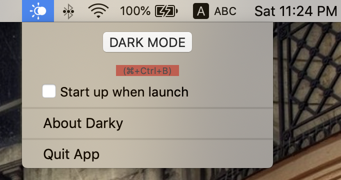
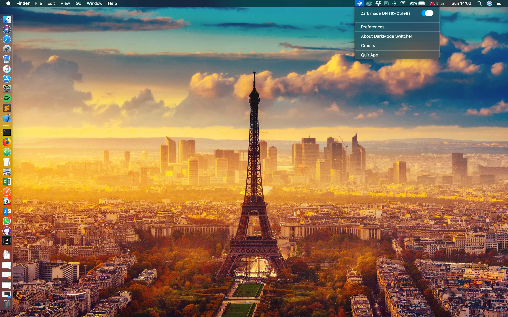

# Darky 

A small Mac OS App that allow you on Mac OS Mojave to switch between Dark Mode and Light Mode directly from a shortcut or via the status menu bar.

**Current Release Version: 1.1

## Why this App can be useful ?

In Mojave in order to change the dark mode status you need to open the system preference each time ! Why having a shortcut could not be more easier ?

This is why I build this tiny status bar app.

## Getting Started

This is a MacOSX App build with xCode using Swift 5.0 and temporary exceptions in order to handle System Events and Preferences panels events

This App cannot be allowed on the Mac App Store due to the necessary temporary exceptions required. (Except if you manage to bribe some Apple Reviewers :))

## How to download directly the App ?

Just download the App zip file here : https://github.com/mohamed-arradi/DarkModeSwitcher/tree/master/Release

### Language handled

- **French & English ONLY for now. (Don't hesite to contribute to translate)

### Screenshots

*Dark Mode Off*

*Dark Mode On*

### Contributing

If you want to contribute to improve it, it will be with pleasure !

### TO DO

- Sunset / Sunrise automatically

### HISTORY

**1.0.1**

 * Thanks to community, the shortcut has been done simple (just ⌘+D) and you are set
 * Removed unecessary library dependencies

**1.0**

 * Improving UI
 * Added Missing Permissions for Mac OS Mojave
 * Implemented keyboard shortcut 

### Image Credits

**Icons Credits**:

- https://www.flaticon.com/authors/epiccoders (www.flaticon.com)

- https://www.iconfinder.com/vectorsquare

### License

This project is licensed under the MIT License - see the [LICENSE.md](LICENSE.md) file for details

### Support

You like it ? help supporting this app by donating or contributing

